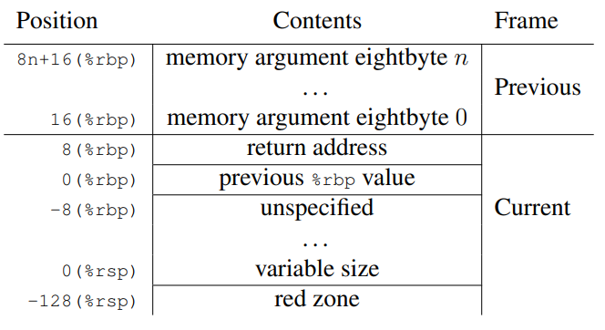

### Как устроен стековый фрейм на x86\_64 для System V ABI? Как передаются аргументы? Как получить возвращаемое значение из функции? Восстановление стек трейса, как его можно реализовать в программе? Как узнать, когда перестать раскручивать фрейм? Что можно сделать, если код не выделяет стековый фрейм явным образом (-fomit-frame-pointer)?  
Интересный момент в том, что calling convention распространяется только на функции, которые можно вызвать из других единиц трансляции, все локальные функции не обязаны отвечать требованиям стандарта. Тем не менее, рекомендуется все функции писать в соответствии с единой конвенцией.

Устройство фрейма: 
RedZone -- специально зарезервированное место, которое не могут изменять сигналы и обработчики прерываний, поэтому формально функция может использовать это место для собственных целей. Поэтому иногда таким образом экономят машинные инструкции инкремента и декримента значения регистра rsp, но это возможно только в случае, если красная зона используется до вызовов других функций (или leaf functions).  

Передача аргументов в функцию:
- Если аргументы представимы в виде целых чисел, то первые 6 таких аргументов будут переданы через регистры rdi, %rsi, %rdx, %rcx, %r8, %r9.  Последующая передача даже целочисленных аргументов будет выполняться через стек. 
- Если аргумент относится к категории MEMORY (This class consists of types that will be passed and returned in memory via the stack.), то он будет передавать только через стек.
- Если аргумент относится к типу SSE (The class consists of types that fit into a vector register.), то он будет передан через xmm регистры, начиная с %xmm0 и заканчивая %xmm7.
- Если аргумент относится к типу SSEUP (The class consists of types that fit into a vector register and can be passed and returned in the upper bytes of it.), то ячейки по 8 байт будут записываться в следующем доступном восьмибайтовом фрагменте ранее использованного векторного регистра. 
- Во всех остальных случая идет передача аргументов через стек.
Если использован вызов функции с переменным числом аргументов, то в %al теневым аргументом передается значение не меньше переданных в функцию аргументов (uuper bound).


Возвращаемое значение:
- Если возвращаемое значение относится к категории MEMORY, то вызывающая сторона обязана выделить под нее память и передать указатель на эту память в регистре %rdi. В случае возврата из функции, память по адресу в %rdi будет заполнена, а в %rax вернется адрес, который изначально был передан в %rdi.
- Если тип возвращаемого значения целочисленный, то оно вернется в регистрах %rax, %rdx.
- Если тип возвращаемого значения SSE, то будут задействованы регистры %xmm0, %xmm1
- С SSEUP аналогично передаче в функцию
- Если тип с плавающей точкой (категория X87), то значение будет лежать в %st0 (80 битовый регистр)
- Для X87UP (X87, X87UP These classes consists of types that will be returned via the x87 FPU.) Значение вернется в %st0 вместе с уже записанным туда значением. 
- Для типа COMPLEX_X87 реальная часть будет возвращена в %st0, а мнимая в %st1.
	Пример для типа COMPLEX_X87:
```
struct complexT {
	T real;
	T imag;
	};
```


Получить стек трейс можно с помощью последовательного разыменования регистра rbp.
Нужно перестать раскручивать фрейм, когда значение регистра rbp будет равно 0.

Получить стектрейс с -fomit-frame-pointer:


### Где аллоцируется стек ядра, стек прошивки? Когда JOS использует тот или иной стек, когда перестаёт использовать стек прошивки? Всегда ли стек доступен? Почему нельзя переиспользовать стек прошивки в ядре?  


### Как запускается JOS на 32-битной прошивке UEFI? В чём отличия от 64-битного запуска? Зачем нужен head64 (bootstrap.S) при запуске JOS? Можно ли было избежать его реализации (объединив его код с entry.S)?